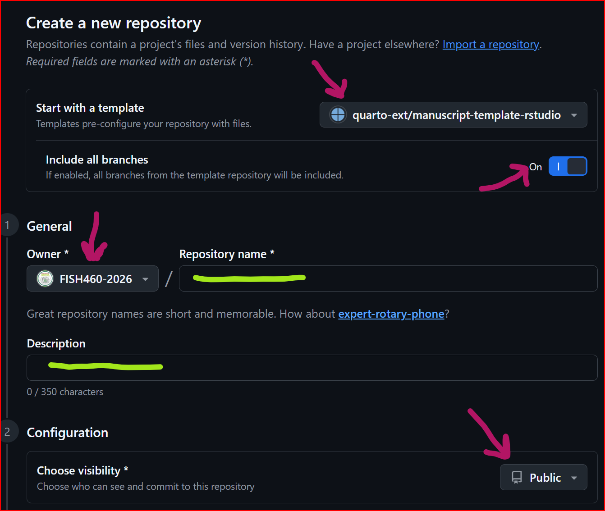
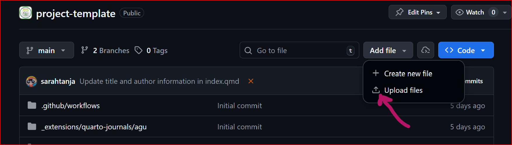
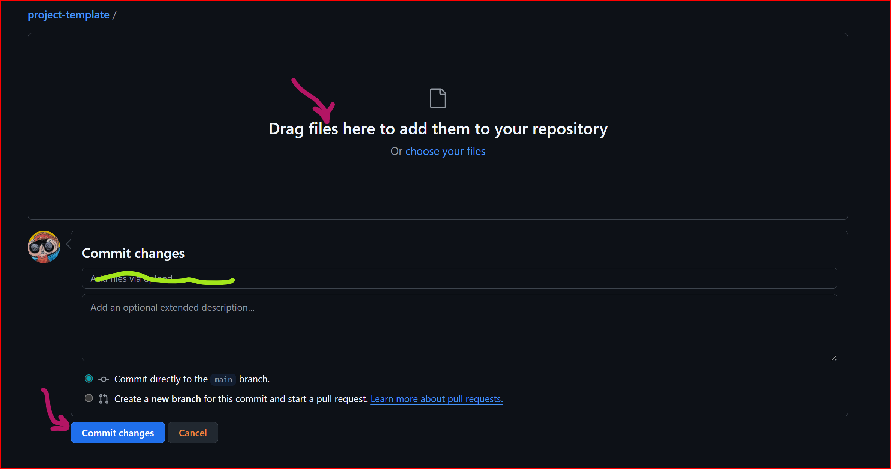
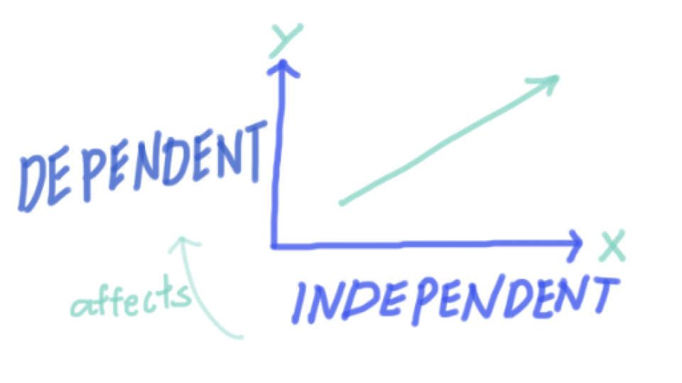
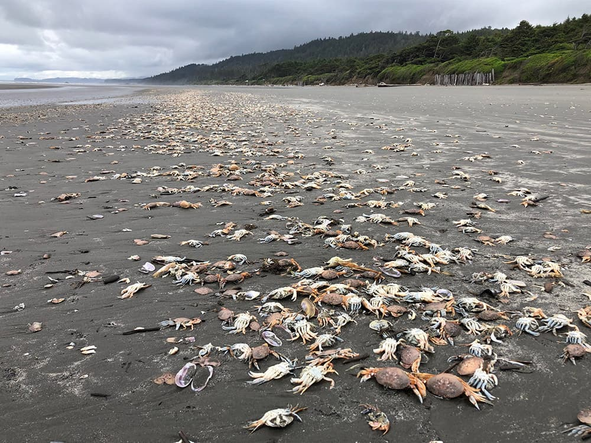

:::: {#description}
#### Lab Assignment: 

Your Lab 2 assignment is due before the start of Lab 2, and you will need time to complete it! Your annotated bibliographies need to include 8 peer-reviewed journal articles and 2 public media news articles.

::: callout-important
Print a hardcopy of your annotated bibliography to bring to Lab 2! You will need this to participate in the 'group speed dating' excercise during Lab 2 to establish your research teams.
:::

Have your computer and electronic copy with you as well!

#### Lab Goals:

1.  WHAT: Identify research topics

2.  WHO: Establish a research team

    -   Make a team GitHub repository from a template

3.  HOW: Lab equipment scavenger hunt to explore...

    -   How could you control your independent variable?

    -   How could you measure your dependent variable?
::::

# 1. WHAT: Identify research topics (\~30mins)

In this first part of lab we will be synthesizing what you learned from your annotated bibliographies into larger research topic themes. We will do this through a sticky note activity!

## ✍️ Step 1: Write your research questions on sticky notes

Take some time to review your annotated bibliography and think about the research questions that interest you.

## Step 2: Form groupings of sticky notes with similar questions 

Do this by TALKING to your classmates. ASK EACH OTHER:

-   What questions did other students explore?

-   Can we collectively group the various questions into broad research themes?

-   Which theme interests you? Which theme do the questions you like to ask fall under?

## 🖌️Step 3: Identify broad guiding research questions from the research question themes

-   What broad guiding research question is the root of the research theme?

-   Is the broad research question applied? How does knowing the answer to the question practically help marine resource managers/ shellfish business owners/ habitat restoration planners/ etc. etc. ?

# 2. WHO: 🧪Establish a research team (1hr 20mins)

::: callout-note
We will run this exercise outside weather permitting
:::

## 🎯 Objective

Form a research team (3–4 students) based on **shared interests**, **compatible work styles**, and **complementary skills**—not just who you already know.

## ⏱️ Activity Overview

You will rotate through a series of short (3–5 minute) conversations with classmates. Think of this like **academic speed dating**.

Your goal is to identify people you:

-   Are excited to work with

-   Can communicate well with

-   Complement (not duplicate) in skills

## 🧭 Step 1: Prepare (5 minutes)

Before rotations begin, reflect and jot down:

**1. Research Interests**

-   What topics excite you?

-   What kinds of questions do you want to ask?

**2. Work Style**

-   Structured vs flexible?

-   Early starter vs deadline-driven?

-   How much time do you allocate to this project?

**3. Motivation & Goals**

-   What do you want out of this project/course?

-   Grade-focused, skill-building, curiosity-driven?

**4. Technical Skills (be honest!)**

-   R experience (none → advanced)

-   Git/GitHub experience (none → confident)

-   Any other relevant skills?

## 🔁 Step 2: Speed Rounds (30–40 minutes)

You will rotate partners (find groups of 2 to 3 students!) every few minutes.

For each person, quickly discuss:

### 💬 Core Questions

-   What are you interested in studying?

-   How do you typically work on projects?

-   What motivates you in this class?

-   What’s your experience with R and Git?

### 📝 While you talk, rate them (quick gut check):

| Category                    | Notes |
|-----------------------------|-------|
| Research interest alignment |       |
| Work style compatibility    |       |
| Motivation match            |       |
| Skill complementarity       |       |

⚠️ **Important:**\
For *R/Git skills*, do NOT just pick people at your same level.\
👉 Strong teams mix beginners and experienced users.

## 🧠 Step 3: Evaluate Your Options (10 minutes)

After rotations, review your notes, talk with potential teammates!

Ask yourself:

-   Who did I feel most comfortable communicating with?

-   Who shares my interests (or complements them)?

-   Does this group balance skills (not all beginners or all experts)?

-   Would I trust this group to follow through?

## 🤝 Step 4: Form Teams

Form a team of **3–4 students**.

### ✅ A strong team should have:

-   ✔ Shared or compatible research interests

-   ✔ Compatible work styles

-   ✔ Similar levels of commitment/motivation

-   ✔ **Mixed R/Git experience levels**

## 🚨 Common Pitfalls to Avoid

-   ❌ Choosing only your friends

-   ❌ Ignoring work style differences

-   ❌ Forming a team with identical skill levels

-   ❌ Prioritizing “easy” over “effective”

## 💡 Pro Tip

The best teams are not the most similar—they are the most **balanced and communicative**.

## 🧩 Final Thought

You’re not just picking teammates—you’re choosing collaborators for a real research experience.\
Be intentional.

## 📋 Step 5: Submit Your Team

Once formed, come up to the TA and submit:

-   Team member names

-   A short (2–3 sentence) justification:

    -   What is your guiding research question?

    -   How is this **applied**?

::: callout-important
Only proceed from Step 5 to Step 6 once the TA has approved your team formations!
:::

## 💻 Step 6: Make a team GitHub repository (repo)

We are going to use a template to create team project repositories on GitHub. This will be the place where **today you will upload your annotated bibliographies**, and eventually, your Letter of Intent (LOI), proposal pitch slide deck, experiment records, data, mini paper, and final presentation.

::: callout-tip
Gather your research team and work together around 1 laptop! As a team you only need to make 1 repo... it doesn't matter who 'drives' but it would be helpful for the teammates to 'navigate' them with these instructions as you work together to make your repo.
:::

1.  To get a broad picture of the end goal for your project management, check out the [quarto manuscript template](https://quarto-ext.github.io/manuscript-template-jupyter/). This is what your team will turn your research project into by the end of the quarter.

2.  Notice the Notebooks on the menu that hovers to the left of the manuscript content. Click on these and explore them too.

3.  Navigate to this link to [Create a new GitHub repository from the template](https://github.com/quarto-ext/manuscript-template-rstudio/generate)

    

::: callout-note
Make sure to toggle 'include all branches', use the drop down to select FISH460-2026 as the repo 'owner', and configure the visibility to 'Public'
:::

4.  Choose a repository name that reflects your research team's guiding question and includes the lab section of your group (ex. crabby-patty-AA). Names should be all lowercase and use kebab-case-only ... where all lowercase words are connected-with-hyphens. Make your research team's repo name unique to be able to differentiate it easily from the \~14 other group repos that will be made in the `FISH460-2026` organization. **Brownie points for puns!**

5.  Once configured click `Create repository`

6.  Your repo should now exist with the `FISH460-2026` organization. The benefit here is that this fosters extreme collaboration within and even between individuals! Everyone can see each other's work.

    ::: callout-important
    The person who created the repo is the admin and has to invite the other research team members as collaborator to the repo. To do this, click on `Settings` in the menu bar of your repo, then click `Manage access` from the left hand menu, then click `Invite a collaborator` and search for your team members by their GitHub username to invite them to the repo. Set each team member as a repo admin. 
    
    Now each member of the research team should be able to access the repo. Test it out by each hopping on your laptops, heading to the GitHub `FISH460-2026` organization and uploading your anYnotated bibliography document (in whatever file format you've got.. .doc, .docx, .pdf, .md, .txt... whatever!)
    :::

7.  **Each member of the research team** navigate to your team repo and click the `Add Files` drop down and select `Upload Files`

8.  Drag and drop your annotated bibliography file to your team's repo

::: callout-tip
Add a commit message... a note about what you did that lives with the version of the file that you uploaded. An example might be "sarah's anno bib initial upload during lab 2" ... then click `Commit changes`
:::

You'll notice when you navigate back to your repo root (the umbrella folder that contains your research team repo) your file is now uploaded to the repository. In future weeks, we will learn how to organize your files, access and edit them from within RStudio, and `push` commits from your local RStudio interface back to GitHub.

::: callout-important
Lab Break! Go take care of yourself and touch grass for 10 minutes between 1520-1530 (3:20 - 3:30PM) ... Come back energized by 1530 (3:30PM)
:::

# 3. HOW: Lab equipment scavenger hunt (\~50 minutes)

Now that you have formed your teams, spend the last \~50 minutes of lab \[1530-1620 (3:30-4:20PM)\] on a 'scavenger hunt' to get eyes on the lab equipment and begin thinking about your independent and dependent variables for your study. Work as a research team to begin answering the following questions together:

-   What lab tools do we have?

-   What can we control? How?

    -   How could we control our independent variable?

-   What can we measure? How?

    -   How could we measure our dependent variable?

{fig-alt="The independent variable is on the X axis and affect the dependent variable on the Y axis"}

::: callout-caution
Don't forget to listen up IN LAB for instructions on your exit tickets worth 3pts!
:::

# Up Next

::: callout-note
#### Lab 3 Assignment: 

Each lab group will submit a single LOI by **the end of Week 3 Lab by 1620 (4:20PM)** to their group Git repository.
:::

## Week3 Lab Assignment

In the world of scientific research, many projects begin with a Request for Proposals (RFP). An RFP is a formal document issued by a funding agency or organization that outlines a specific problem or research area they want to address. It includes background information, goals, and the kinds of projects or solutions they are looking to fund. Researchers respond to RFPs by developing proposals tailored to the outlined needs and priorities.

Before submitting a full proposal, (in your case, your group will 'pitch' their full proposal as a slide deck presentation) many funders require a Letter of Intent (LOI). This is a brief document that outlines the research team’s proposed project, including the objectives, significance, and general approach. The LOI helps funders gauge interest and ensure the proposed ideas align with the goals of the RFP before reviewing full proposals.

Your Task:

For this assignment, your group will work together to fill out the Letter of Intent (LOI) template in response to a provided RFP. This RFP will outline a broad scientific challenge or research need, and your LOI should be a direct and thoughtful response to that call.

Your LOI should include:

-   A clear project title

-   A brief description of your guiding research question

-   How your project aligns with the RFP

-   The objectives and potential impact of your proposed work

-   The general methodology or approach you plan to use

Why this matters: This exercise mirrors real-world scientific funding processes and helps you develop skills in clearly framing your ideas, aligning them with broader goals, and communicating your intent effectively to a specific audience.

::: callout-note
### Download RFP & LOI template

-   [RFP](%22Request%20for%20Proposals%20(RFP).pdf%22)
-   [LOI Template](%22Letter_of_Intent_Template.md%22)
:::

Be sure to read the RFP carefully and tailor your LOI to fit its scope and priorities.

# Bonus 

[{fig-alt="Massive die-offs of Dungeness crab have been documented off the Pacific Northwest Coast. Once dead, the aquatic crabs often wash up on beaches, such as the ones photographed on Kalaloch Beach on June 14, 2022. Photo: Jenny Waddell/NOAA"}](https://sanctuaries.noaa.gov/news/nov22/stressed-out.html)

Header image (shown above) is from the article [Stressed Out: Dungeness Crab off the Pacific Northwest Coast by Sarah Marquis, NOAA/NMS](https://sanctuaries.noaa.gov/news/nov22/stressed-out.html).

## YouTube Videos with additional background information about European green crabs on the  US West Coast 

### Preventing a green crab invasion UW College of the Environment



### Sea otters credited with solving Elkhorn Slough's invasive green crab problem



### [Green Crab Invasion Hits Puget Sound](https://youtu.be/52NkcbA1FVY?si=Fgxi1avkgwQKFFQM)


