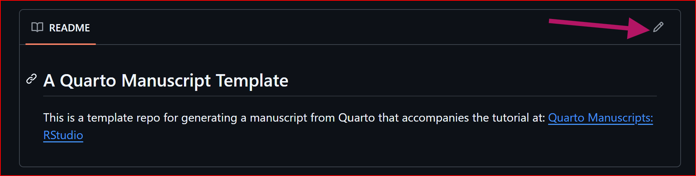
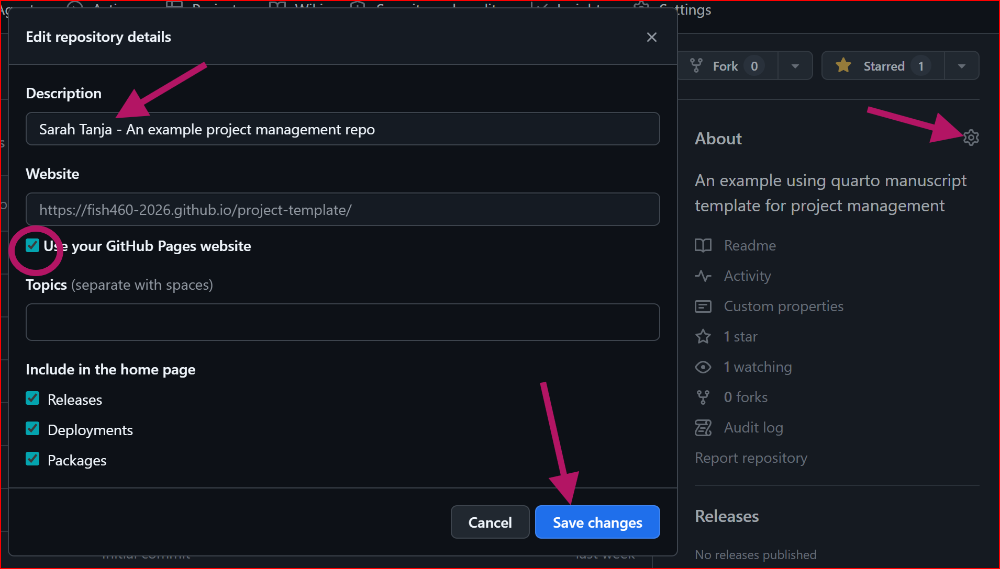
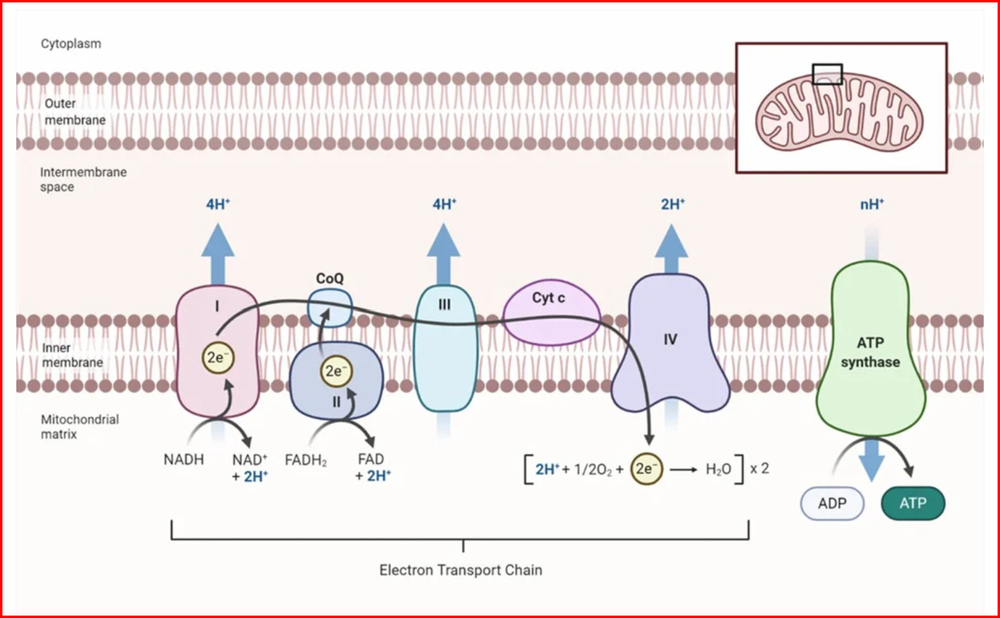

::: {#description}
#### 💻 Lab Assignment:

Each lab group will submit a single LOI **by the end of Week 3 Lab by 1620 (4:20PM)** to their group Git repository.

#### 🎯 Lab Goals:

1.  Discuss how we will use git and R to record and share our research process

2.  Discuss constraints of experimental design

3.  Link the Broad Question --\> Data Needed --\> Experimental Design

4.  Submit a Letter of Intent (LOI) for your team project proposal to your team git repository

5.  Start preparing for your team project proposal pitch presentation in Week 4 Lab
:::

# Step 1. Discuss how we will use git and R to record and share our research process

## Check out the [project-template](https://github.com/FISH460-2026/project-template) repo

Use the project-template repo as an example of how to structure your project repository on GitHub. This template includes folders for data, code, and documentation, as well as a README.md file that provides an overview of the project and instructions for how to use the repository.

::: callout-important
**In Week 4 and 5 we will *slowly* learn how to edit these files by cloning our repository to RStudio!**
:::

The goal here is for your team to have a group landing page for your project, and individual manuscript pages in the notebooks folder.

Your research team will use the `gh-pages` branch of your GitHub repository to create a project website that documents your research process and findings, **and publishes your FINAL MINI PAPERS!** This website can include information about your research question, experimental design, data collection methods, and results. You can also use the website to share code or data that you generate during your research process.

The webpage is automatically deployed when you make changes to your repo. The only files you need to change are the `index.qmd` or newly generated `notebook/ *.qmd` files

## Update README

Your research team needs to update your git repo README.md file to include a brief description of your project. For now, keep this brief (1 sentence). This will help you keep track of your project and make it easier for others to understand what your project is about when they visit your GitHub repository. You can always update this later as your project evolves and you have more information to share about it.

{fig-alt="Edit REAME page on your team GitHub repo by clicking the pencil outline icon"}

## Update About

Your research team needs to update the "About" section of your GitHub repository to **include the names of the team members in the description field**. This will help you keep track of your project and make it easier for me to know who is working on what!

Also click the `Use your GitHub Pages website` check box to link your project webpage (which is automatically being generated and deployed!)

{fig-alt="Edit your GitHub About section by clicking the cog wheel to the right of the About header in your research team github repo"}

# Step 2. Discuss Constraints of Experimental Design

## Study specimens (n)

-   24 total *Carcinus maenas* crabs available for experimentation across AA and AB lab sections

    -   (with 11 total teams, that makes \~2 per team!)

-   \~240 total *Hemigrapsus oregonensis* crabs available for experimentation across AA and AB lab sections

    -   (with 11 total teams, that makes \~22 per team!)

## Time

-   9 hours of data collection per team (3 hours per day for 3 lab days)

    -   unless your research team wants to collect data outside of lab time (which is possible, but you will need to make arrangements with the TA to access the lab and animals outside of scheduled lab time) The lab is NOT designed for you to do this to be successful and receive full marks, but it is an option if you want to collect more data than what is possible during lab time.

-   Respirometry resazurin assay [protocol](https://robertslab.github.io/resources/protocols/resazurin-assay/) from the Robert's lab and a modified [protocol](https://github.com/zbengt/FISH460-Spring2025/blob/main/procedures/FISH460_Resazurin_Assay.pdf) for FISH 460 from [Zach Bengtsson](https://github.com/zbengt) takes ***at least 1 hour*** of time in which crabs are set in isolated small plastic cups filled with a redox reactive dye solution that turns from blue to pink as the crab does metabolic respiration.

::: column-margin
{fig-alt="Resazurin is a redox reactive dye that turns from blue to pink as NADH is reduced to NAD+ in metabolic respiration."}
:::

::: column-margin
{fig-alt="The electron transport chain in the mitochondria cell membrane reduces NADH to NAD+ and produces ATP, the energy currency of the cell. Resazurin is reduced by NADH and reductases, producing a strong fluorescent response."}
:::

> As the organism conducts metabolism, resazurin undergoes a stepwise reduction from its blue, non-fluorescent, oxidized form to pink, fluorescent, resorufin by NADH and reductases, producing a strong fluorescent response [@Huffmyer2025-xj]

-   ::: callout-important
    Does the duration of your stress exposure match up with the timeline of physiological change in your response?
    :::

    -   ex. If you heat-shock a crab for 10 minutes, and then try to measure the change in osmolality[^1] the whole-body osmolality has not yet had time to shift... the earliest measurable difference (speed of response) may be on the order of hours to days

[^1]: Osmolality, in milliosmoles per kilogram (mOsm/kg) is a measure of the total concentration of dissolved solutes—principally sodium Na+ and chloride Cl- ions, along with other electrolytes and organic solutes—within the crab’s blood. 1 **osmole** = 1 mole of *osmotically active particles i.e. dissolved particles that contribute to osmotic pressure– anything that affects water movement across a membrane.* This measurement is primarily used to assess the animal's **osmoregulatory status**, specifically its ability to regulate its internal solute concentration in response to changes in the salinity of the surrounding water.

## Sharing tank space

-   2 water baths available for experimentation across AA and AB lab sections!
    -   1 water bath for ambient temperature treatment
        -   This means we can collectively pick 1 ambient temperature to use across all teams
        -   (e.g., 10°C)
    -   1 water bath for elevated temperature treatment
        -   This means we can collectively pick 1 elevated temperature to use across all teams
        -   (e.g., 20-25°C?)
    -   1 'lobster control tank' for a shared pool of control crabs at puget sound conditions

## Example[^2] confounding variables

[^2]: not an exhaustive list!

-   Crabs are sensitive to stress → handling must be standardized
-   Metabolic rates vary with size → take weights and normalize response variable by size!
-   Sex matters(?) → control or include as a co-variate!
-   Will position in the temperature bath matter? → If so... randomize tank placement in temperature bath
-   What other confounding variables can you think of? How can you randomize or control for these?

::: callout-important
Experimental design checklist:

-   [ ] What is my hypothesis?

-   [ ] What is my independent variable?

-   [ ] What is my response variable?

-   [ ] How quickly does my response variable respond?

-   [ ] What are my controls?

-   [ ] What is my unit of replication (crab or tank)?

-   [ ] How many replicates per treatment?

-   [ ] How am I randomizing?

-   [ ] What could confound this?
:::

# Step 3. Link the Broad Question --\> Data Needed --\> Experimental Design

In this part of lab your team will work together using sticky notes and whiteboard markers to identify the broad research question your study will address, the data you will need to answer that question, and the experimental design you will use to collect that data. This process will help you clarify your research goals and ensure that your experimental design is well-aligned with your research question.

Wth your team, discuss these three components, then use sticky notes to write down your ideas and arrange them on a whiteboard to show the relationships between the broad question, the data needed, and the experimental design.

\![\] (xy.png){fig-alt="Use sticky notes to link the broad question, data needed, and experimental design on a whiteboard"

-   ::: callout-note
    -   Does the broad question clearly state the research problem or area of interest?

    -   Is the data needed clearly defined and relevant to the broad question?

    -   Does the experimental design logically follow from the broad question and the data needed?

    -   Are there any potential issues or challenges with the proposed experimental design?
    :::

# Step 4. Submit a Letter of Intent (LOI) for your team project proposal to your team git repository

## Week3 Lab Assignment

In the world of scientific research, many projects begin with a Request for Proposals (RFP). An RFP is a formal document issued by a funding agency or organization that outlines a specific problem or research area they want to address. It includes background information, goals, and the kinds of projects or solutions they are looking to fund. Researchers respond to RFPs by developing proposals tailored to the outlined needs and priorities. In this case the International Society for Crustacean Ecophysiology is a made up funding agency that has issued an RFP for research on the physiological responses of crabs to environmental stressors.

<object data="Request for Proposals (RFP).pdf" type="application/pdf" width="100%" height="500px">

Unable to display PDF file. <a href="Request for Proposals (RFP).pdf">Download</a> instead.

</object>

Before submitting a full proposal, (in your case, your group will 'pitch' their full proposal as a slide deck presentation) many funders require a Letter of Intent (LOI). This is a brief document that outlines the research team’s proposed project, including the objectives, significance, and general approach. The LOI helps funders gauge interest and ensure the proposed ideas align with the goals of the RFP before reviewing full proposals.

Your Task:

For this assignment, your group will work together to fill out the Letter of Intent (LOI) template in response to a provided RFP. This RFP will outline a broad scientific challenge or research need, and your LOI should be a direct and thoughtful response to that call.

Your LOI should include:

-   A clear project title

-   A brief description of your guiding research question

-   How your project aligns with the RFP

-   The objectives and potential impact of your proposed work

-   The general methodology or approach you plan to use

Why this matters: This exercise mirrors real-world scientific funding processes and helps you develop skills in clearly framing your ideas, aligning them with broader goals, and communicating your intent effectively to a specific audience.

### Download RFP & LOI template

-   [RFP](%22Request%20for%20Proposals%20(RFP).pdf%22)
-   [LOI Template](%22Letter_of_Intent_Template.md%22)

Be sure to read the RFP carefully and tailor your LOI to fit its scope and priorities.

# Step 5. Start preparing for your team project proposal pitch presentation

... see Up Next below ⬇️ for details

::: callout-caution
Don't forget to listen up IN LAB for instructions on your exit tickets worth 3pts!
:::

# Up Next

::: callout-tip
#### Lab 4 Assignment:

**!!! Upload your team project proposal pitch presentation to your team Git repository before the start of Week 4 Lab!!!**

Present your team project proposal pitch presentation to a panel of judges (TAs and instructors) in Week 4 Lab. Each team will have 10-15 minutes to present their proposal, followed by a 5-minute Q&A session with the judges.
:::

Your research team is responsible for the development of a research question, and the design and execution of an experiment to address it.

Before you start your experiment, you must defend your proposal.

Specific instructions for the defense:

We expect you to prepare a 10-15 min group presentation using PowerPoint / Google slides. You must include a background (using relevant literature) leading to a general research question, and a set of specific hypothesis (framed as null and alternative hypotheses)

You must include a very specific experimental design, making sure that results generated therein will answer the hypothesis you propose. Don't forget to indicate your design replicates! Be ready to receive feedback and to answer questions. You will be graded on both the presentation of your project, and the defense of it (your response to questions from the audience, including the teaching team). Expect to use the whiteboard to answer some of the questions.

Every member of the research team must participate in the presentation and defense of the project, otherwise members that do not engage will be penalized with a 20% penalty in their grade. The teaching team will provide feedback to each proposal, and you will have to incorporate that feedback in order to get the proposal approved. It is not the mission of the teaching team to design an experiment for you, so please do not bring half-cooked projects.

If we feel that a project needs some major revision, you will have until the end of the lab session to revise and re-defend your proposal. At this point a 10% penalty will apply.

Good luck.

# Bonus

Early Detection Mode: The European Green Crab Tulalip TV YouTube video For the crab-rooms research team! 

[From Blue to Pink: Resazurin as a High-Throughput Proxy for Metabolic Rate in Oysters](https://www.biorxiv.org/content/10.1101/2025.11.06.686367v1) preprint manuscript from the UW Robert's Lab!

<object data="Huffmyer et al. 2025 - bioRxiv.pdf" type="application/pdf" width="100%" height="500px">

Unable to display PDF file. <a href="Huffmyer et al. 2025 - bioRxiv.pdf">Download</a> instead.

</object>
