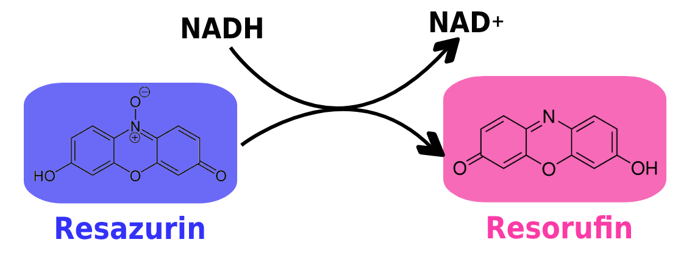
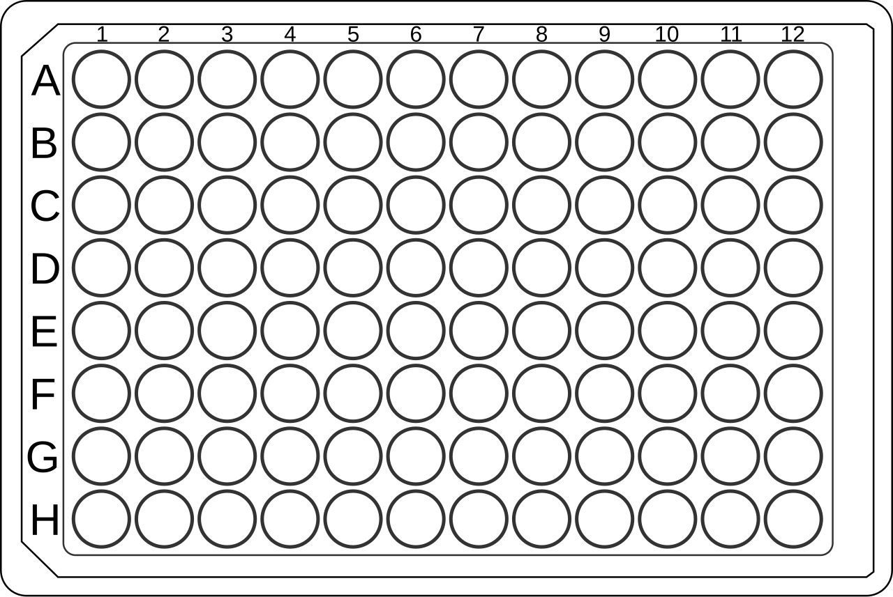

::: {#description}
#### Lab Assignment:

Each research team member will link their data sheet(s) and upload notes on experimental setup, methods, and protocols to their github repo README in Week 5 Lab. **Each member needs to upload at least 1 item.** You will be graded individually for checking this off.

#### 🎯 Lab Goals:

1.  Resazurin demo

2.  Hemolymph extraction demo

3.  Osmolality reading demo

4.  Set up exeriment

5.  Set up data sheets

6.  Record methods with photographs and written protocols
:::

# Resazurin protocol, a measure of metabolic activity

Resazurin is a blue redox-sensitive dye that is reduced by cellular respiration to resorufin, providing a proxy for metabolic activity.

Resorufin is pink and highly fluorescent (excitation \~570 nm, emission \~585 nm). The amount of pink resorufin produced is directly proportional to the metabolic activity of the cells. You can learn more about how the Robert's Lab is implementing easy resazurin metabolism assays for oysters [here](https://oyster.pink/).

-   [ ] Lay out a 6-well plate, plastic cup, or beaker (depending on size of crab) for each crab that is undergoing the metabolic activity resazurin trial

-   [ ] Lay out an additional chamber as a blank (one at least for each trial!)

-   [ ] Map out your 96 well plate

    Each cup (crab sample and blank cups!) should have a column (1-12)

    Each Timepoint (`T0`, `T1` , `T2`) should have a row

    The `well` is the row X column identifier (i.e. A1)

-   [ ] Navigate to the [FISH460 Resazzy Plates Google Sheet](https://docs.google.com/spreadsheets/d/1VI88fQfNNTEIkHj0mWmoBj__-yAG_r3moMml-DOSNPA/edit?usp=sharing)

-   [ ] Copy the template sheet to a new sheet (keep it in the sample Google spreadsheet, just add to it!) and rename the copy with your research team name

-   [ ] Fill in the datasheet with your 96 well plate map info! Add any additional metadata per your research. You will reuse this same sheet for each week of data collection!

-   [ ] Show the TA your 96 well plate map and datasheet... only THEN will you get resazurin working solution!

-   [ ] Don lab gloves!

-   [ ] Fill each 6 well plate with **8 mL** of resazurin working solution, if needed, add just enough to submerge any larger crabs in larger chambers. Record volumes for each adjusted cup.

-   [ ] Pull `T0` measurement. Pipette **200 𝛍L** aliquots from each cup, and place them in your 96 well plate

-   [ ]  Place 1 crab in each cup or beaker, start your timer! 🦀⏲️

-   [ ] Wait 30 minutes

-   [ ] Pull `T1` measurement. Pipette **200 𝛍L** aliquots from each cup, and place them in your 96 well plate

-   [ ] Wait 30 minutes

-   [ ] Pull `T2` measurement. Pipette **200 𝛍L** aliquots from each cup, and place them in your 96 well plate

-   [ ] When done cover your well plate and ask your TA to measure the fluorescence using a spectrophotometer plate reader

-   [ ] Using gloved hands withdraw crabs from their cups, rinse them in saltwater

-   [ ] Pat them dry and weigh them! Record their weight. This is used to normalize the data to each individual crab's mass.

-   [ ] Rinse crabs in seawater a 2nd time

-   [ ] Return them to experimental conditions
